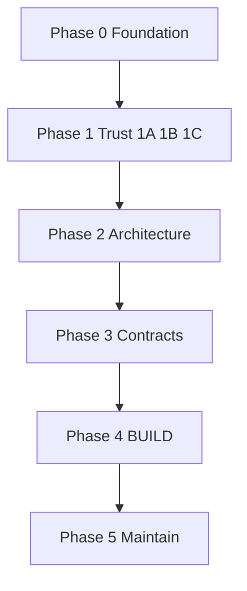

# StackForge — Professional delivery phases

This document turns the product vision in [`New-imp.md`](./New-imp.md) into a **sequenced, shippable roadmap**. Each phase has clear goals, deliverables, and exit criteria so releases stay professional and scope stays controlled.

**Product identity (target):**

> StackForge is a production-oriented full-stack TypeScript scaffolding system for Next.js + NestJS applications.

**Three pillars:**

| Pillar       | Meaning                                | Example commands                                             |
| ------------ | -------------------------------------- | ------------------------------------------------------------ |
| **Generate** | Bootstrap correct architecture once    | `npx create-stackforge-app`                                  |
| **Extend**   | Add modules and features over time     | `stackforge add …`, `stackforge generate …`                  |
| **Maintain** | Diagnose and evolve generated projects | `stackforge doctor`, `stackforge diff`, `stackforge upgrade` |

**Golden path (default stack):** Next.js (App Router) + NestJS + Prisma + PostgreSQL or SQLite + pnpm workspaces.

**Principles**

- **Modules, not defaults** — the default app stays understandable; advanced capabilities are opt-in.
- **Trust before differentiation** — no placeholder presets, no fake UI, no half-finished auth.
- **One source of truth per contract** — avoid Zod + class-validator + Swagger + client describing the same API three different ways.
- **Idempotent modifiers** — running `stackforge add redis` twice must not duplicate imports, env keys, or Docker services.
- **Dry-run before write** — generators and `add` support `--dry-run` before modifying a project (Phase 4+).

**Command lifecycle (target)**

```
create  →  generate / add  →  doctor  →  diff  →  upgrade
```

---

## CLI surface (target)

All subcommands support documented short aliases where noted.

| Command                               | Alias                          | Phase |
| ------------------------------------- | ------------------------------ | ----- |
| `stackforge generate resource <name>` | `stackforge g resource <name>` | 4     |
| `stackforge add <module>`             | —                              | 4     |
| `stackforge doctor`                   | —                              | 2     |
| `stackforge info`                     | —                              | 2     |
| `stackforge diff`                     | —                              | 5     |
| `stackforge upgrade`                  | —                              | 5     |

Create remains: `npx create-stackforge-app` (npm package) invoking the same StackForge core.

---

## Roadmap overview

```
                         STACKFORGE

Phase 0 — Foundation
│   versioning, ownership model, CI, manifest v1
│
▼
Phase 1 — Trust (1A → 1B → 1C)
│   correctness, auth (Bearer first), migrations, security, real dashboard, tests
│
▼
Phase 2 — Architecture
│   apps/web, apps/api, packages/*, doctor, info, presets (real only)
│
▼
Phase 3 — Contracts
│   shared validation, OpenAPI, typed client, React Query integration
│
▼
Phase 4 — BUILD ⭐ product differentiator
│   g resource, add, plugins, RBAC, organizations, saas preset (when complete)
│
▼
Phase 5 — Maintain
    diff, upgrade, plugin API, deployment adapters
```



**Sequencing note:** Manifest **v1** ships in Phase 0 so every new app is identifiable before Phase 2 commands exist. Monorepo layout (`apps/` + `packages/`) lands at **start of Phase 2**, not after building doctor/presets on `frontend/` + `backend/`.

---

## Phase 0 — Foundation

**Goal:** Release discipline, file ownership rules, and minimal project metadata from the first generate onward.

### Deliverables

| Area                   | Detail                                                                                      |
| ---------------------- | ------------------------------------------------------------------------------------------- |
| **Versioning**         | Policy for `create-stackforge-app` patch / minor / major; template changes → release notes. |
| **Ownership model**    | Three categories (see below); documented in repo and generated `AGENTS.md` stub.            |
| **StackForge repo CI** | Build CLI + **mandatory** generated-app smoke pipeline (see below).                         |
| **Manifest v1**        | Every new project includes `stackforge.json` (no subcommands required yet).                 |
| **Compatibility matrix** | Published **tested stack** per StackForge release (see below).                            |

**Manifest v1 (minimal example)**

```json
{
  "schemaVersion": 1,
  "stackforgeVersion": "1.1.0",
  "preset": "dashboard",
  "database": "postgresql",
  "docker": true,
  "features": {}
}
```

- **`preset`:** set when the user chose a preset; `null` or omitted until presets ship (Phase 2).
- Expand with **`apps`** paths in manifest v2 (Phase 2). **Do not** wait until Phase 2 to write the file — avoids “legacy” projects with no manifest.

**Manifest v2 (Phase 2 example)**

```json
{
  "schemaVersion": 2,
  "stackforgeVersion": "2.0.0",
  "preset": "dashboard",
  "database": "postgresql",
  "docker": true,
  "apps": {
    "web": "apps/web",
    "api": "apps/api"
  },
  "features": {}
}
```

### Generated-app smoke CI (mandatory)

Every **`create-stackforge-app` release** must pass CI that:

1. Generates a **PostgreSQL** app (flags as used in CI).
2. Generates a **SQLite** app.
3. For each: `pnpm install` → `lint` → `typecheck` → `test` → **build web** → **build api**.

From **Phase 2** onward, also generate and smoke-test each **exposed preset** (`minimal`, `api`, `dashboard`) in CI.

This is not optional for a scaffolder — it prevents template-breaking releases.

### Tested stack matrix (formalize “CI-proven set”)

Maintain a table in repo docs (e.g. `docs/tested-stack.md`) updated on each major template bump. Example shape:

| StackForge | Node | pnpm | Next | React | Nest | Prisma | Postgres |
|------------|------|------|------|-------|------|--------|----------|
| 1.x        | 22 LTS | ≥9 | 14.x | 18.x | 10.x | 5.x | 16+ |

Exact versions = whatever CI runs successfully. **Generated apps and marketing must not claim versions outside the matrix.**

### File ownership (formal)

| Category     | StackForge behavior                     | Examples                                                                             |
| ------------ | --------------------------------------- | ------------------------------------------------------------------------------------ |
| **Managed**  | May update on `upgrade`                 | `.stackforge/`, root `eslint.config`, shared `tsconfig` bases, generated CI workflow |
| **Extended** | Owns structure; user additions expected | `apps/api/src/auth/*`, auth module templates                                         |
| **User**     | Never touch                             | `apps/api/src/domain/*`, custom features, business logic                             |

Optional later: checksums in `.stackforge/lock.json` for managed files to detect drift before upgrade.

### Exit criteria

- Ownership rules written and linked from contributor docs.
- New generates include `stackforge.json` v1 (with optional `preset` field).
- **Smoke CI** green for PostgreSQL + SQLite generates on every release.
- **Tested stack matrix** documented and matches CI.
- No public “production-ready” claim until **Phase 1** exit criteria met.

**Out of scope:** `stackforge add`, generators, presets beyond documenting future names.

---

## Phase 1 — Trust

**Goal:** Make the default generated app **honest and correct**. Market as one “Phase 1” externally; use **1A / 1B / 1C** internally for milestones and releases.

**Theme:** Trust before differentiation.

---

### Phase 1A — Correctness

| Item                | Description                                                                          |
| ------------------- | ------------------------------------------------------------------------------------ |
| Password hashing    | `POST /users` (and all user-creation paths) hash passwords like register.            |
| PostgreSQL / Docker | Fix host port (`5433` vs `5432`) and document container vs host URLs.                |
| Docker + lockfile   | Ensure or document root `pnpm-lock.yaml` before image build (`--no-install` path).   |
| `GET /auth/me`      | Backend returns current user from JWT.                                               |
| Login redirect      | Honor `?from=` after successful login.                                               |
| Remove fake UI      | No fake sessions, health, export, invite, or disabled profile without real behavior. |
| Secrets             | No default `supersecret`; generate dev `JWT_SECRET`; document production rules.      |

**Auth rule for 1A:** Stay on **Bearer token in Authorization header** (Axios + localStorage/cookie for middleware only if already required). **Hydrate user from `/auth/me`**, not stale localStorage alone. **Do not** start HttpOnly cookie + refresh in 1A.

**Suggested release:** `1.0.x` – `1.1.x`

---

### Phase 1B — Production baseline

| Item              | Description                                                                                                        |
| ----------------- | ------------------------------------------------------------------------------------------------------------------ |
| Migrations        | Initial Prisma migration in template; Docker uses `migrate deploy` (or documented equivalent), not only `db:push`. |
| DB scripts        | `db:migrate`, `db:migrate:deploy`, `db:studio`, `db:seed`, `db:reset`.                                             |
| Env validation    | Fail fast on startup with clear messages (e.g. JWT min length).                                                    |
| Strict TypeScript | Stricter tsconfig for api + web.                                                                                   |
| ESLint + Prettier | Works out of the box.                                                                                              |
| Health            | `GET /health` (DB check); dashboard reads it when UI exists.                                                       |
| Rate limiting     | Throttler; tighter limits on auth routes.                                                                          |
| Hardening         | Helmet, CORS, body limits, exception filter, request ID.                                                           |
| Tests + CI        | Auth unit + auth/users e2e; `.github/workflows/ci.yml` with Postgres service.                                      |
| Dependencies      | Bump Next / Nest / Prisma to a **CI-proven** set; Dependabot/Renovate on StackForge repo.                          |

**Suggested release:** `1.2.x`

---

### Phase 1C — Real starter product

| Item               | Description                                                                      |
| ------------------ | -------------------------------------------------------------------------------- |
| User CRUD          | Backend PATCH/DELETE as needed; dashboard create / edit / delete wired.          |
| Profile            | Name, email, change password (real API).                                         |
| Settings           | Theme + account (minimal, real).                                                 |
| Structured logging | Pino (or chosen logger): requestId, route, status, duration, userId when authed. |

**Suggested release:** `1.3.x` or bundle with 1B if scope allows.

---

### Auth architecture boundary (critical)

**Avoid a half-migration:** cookie access token + localStorage leftovers + no refresh rotation + middleware + Axios is worse than today.

| Stage                | Model                                                                                                                                                                 |
| -------------------- | --------------------------------------------------------------------------------------------------------------------------------------------------------------------- |
| **1A**               | Bearer + `/auth/me`; single user state from API; clean redirect.                                                                                                      |
| **2.0 (or late 1B)** | **Complete** HttpOnly access + refresh cookie model, refresh rotation, logout invalidation, CSRF strategy documented — shipped as one breaking semver, not piecemeal. |

Do not document “plan toward cookies” in 1A without a dated boundary for 2.0.

---

### Phase 1 exit criteria (overall)

- CI green on fresh generate without manual fixes.
- No plaintext password storage path.
- Docker + Postgres README steps work copy-paste.
- Dashboard has no pretend features.
- Swagger and README match routes.
- Every project has manifest v1 (from Phase 0).

**Out of scope:** `stackforge g resource`, OAuth, orgs, `apps/` layout (Phase 2), cookie refresh (until 2.0 boundary).

---

## Phase 2 — Architecture

**Goal:** Standard monorepo layout, project awareness CLI, and **only real presets**.

**Theme:** Structure before contracts and generators.

### 2.1 Monorepo layout (breaking change)

New projects generate:

```
apps/
  web/          # Next.js
  api/          # NestJS
packages/
  eslint-config/
  typescript-config/
  ui/           # optional shared UI stub
```

`contracts/` and `api-client/` land in **Phase 3** — do not empty-stub unless needed for workspace wiring.

**Migration:** Document one-time path for old `frontend/` + `backend/` repos; support old layout at most one major version if demand exists.

### 2.2 Manifest v2

Extend `stackforge.json` with `apps.web` / `apps.api` paths, ORM, enabled features, `preset`, ownership hints (see Phase 0 example).

### 2.3 `stackforge doctor` & `stackforge info`

- **doctor:** Node, pnpm, Docker, DB, env, migrations in sync, web → api URL, weak JWT.
- **info:** StackForge version, stack versions, enabled features (support / bug reports).

### 2.4 Presets (real only)

| Preset      | When shippable                                                                             |
| ----------- | ------------------------------------------------------------------------------------------ |
| `minimal`   | Phase 2                                                                                    |
| `api`       | Phase 2                                                                                    |
| `dashboard` | After Phase 1 complete                                                                     |
| `saas`      | **Phase 4 only** — do not expose `--preset saas` until orgs/RBAC/email hooks actually work |

Trust applies to presets: if it appears in `--help`, it must work.

### 2.5 Create flow & agents

- Incremental prompts (architecture, Docker, tests, CI) without combinatorial explosion.
- Generated **`AGENTS.md`** aligned with `apps/web` + `apps/api` and ownership rules.

### Exit criteria

- All new projects use `apps/` + `packages/` layout.
- `stackforge doctor` and `info` run on fresh project.
- **Presets:** `minimal`, `api`, and `dashboard` are all **generated in CI** and each produces a **buildable** application (install → lint → typecheck → test → build web → build api).
- **Every preset exposed in `--help` must pass that CI gate** (no documentation-only presets).
- Manifest v2 written at create time.

**Out of scope:** Full contract package, `g resource`, `stackforge add`, `diff` / `upgrade`.

---

## Phase 3 — Contracts

**Goal:** End-to-end type safety with **one API truth**.

**Theme:** T3-like safety without merging Nest into Next.

### 3.1 Architectural decision (required before code)

Pick **one** primary contract pipeline and document it in `AGENTS.md`:

| Option                                           | Flow                                                           |
| ------------------------------------------------ | -------------------------------------------------------------- |
| **A — Contract-first (recommended to evaluate)** | Zod in `packages/contracts` → Nest validation → OpenAPI        |
| **B — Server-first**                             | Nest DTOs + class-validator → OpenAPI → generated client/types |

**Forbidden long-term state:** Zod + class-validator DTOs + hand-maintained Swagger + duplicate client types for the same endpoint.

### 3.2 Packages

```
packages/
  contracts/    # schemas + inferred types
  api-client/   # typed client (generated from OpenAPI or derived from contracts)
```

Auth, users, pagination, errors live in contracts first; resources added in Phase 4 extend the same pattern.

### 3.3 Integration

- Regenerate or update client when API changes; document command in README.
- React Query hooks call `api-client`, not raw path strings.
- Root: `pnpm dev`, `build`, `lint`, `typecheck`, `test`.

### 3.4 Frontend type rule (enforced convention)

The frontend **must not** manually define an API response interface that already exists in `packages/contracts` or `packages/api-client`.

**Forbidden** in `apps/web/` (example):

```ts
interface User {
  id: string;
  email: string;
}
```

**Required** when types exist in contracts:

```ts
import type { User } from "@repo/contracts"; // or published package name
```

Document in generated **`AGENTS.md`** and enforce via ESLint rule or CI grep when practical. Applies to humans and AI agents.

### Exit criteria

- Login + users list use shared types only; no duplicate `User`-style interfaces in web.
- CI builds all workspace packages.
- Contract pipeline documented in one diagram (no triple validation).

**Out of scope:** Resource generator, plugins, upgrade.

---

## Phase 4 — BUILD (product differentiator)

**Goal:** StackForge helps **after** day one — domain-aware generation and safe modules.

**Theme:** Extend. **Invest design time here.**

### 4.1 `stackforge generate resource` / `stackforge g resource`

Not “dump CRUD files” — **one domain model** drives:

- Prisma model + migration
- Nest module, service, controller
- Validation + Swagger
- Permissions (optional)
- Contract types + client methods
- React Query hooks
- UI: table, forms, search, pagination (per capabilities)
- Tests smoke

**Example interaction**

```
stackforge g resource product

? Fields
  name:string required
  slug:string unique
  price:decimal required
  stock:int default=0
  status:enum[DRAFT,ACTIVE,ARCHIVED]
  categoryId:relation<Category>

? Capabilities
  ◉ List  ◉ Detail  ◉ Create  ◉ Update  ◉ Delete

? UI
  ◉ Data table  ◉ Form  ◉ Search  ◉ Pagination

? Authorization
  ◉ Authenticated  ◉ Admin for mutate
```

**Dry-run (required)**

```
stackforge g resource product --dry-run
```

Prints `CREATE` / `MODIFY` paths under `apps/`, `packages/`, `prisma/` without writing files. Same for `stackforge add <module> --dry-run`.

**Non-interactive mode (required for CI and scripts)**

Flags in addition to interactive prompts:

| Flag / pattern | Purpose |
|----------------|---------|
| `--api-only` / `--no-ui` | Backend + contracts + migration only |
| `--no-delete` | Omit delete capability and UI |
| `--field "name:string:required"` | Repeatable field definitions |
| `--crud`, `--ui`, `--auth` | Capability bundles |

Example:

```bash
stackforge g resource product \
  --field "name:string:required" \
  --field "price:decimal:required" \
  --field "stock:int:default=0" \
  --crud --ui --auth
```

Professional CLI: equally usable for humans (interactive) and automation (flags only).

### 4.1.1 Generator output ownership

After `stackforge g resource` completes, the generated resource is **user-owned**:

- StackForge may **add new files alongside** (e.g. shared util, manifest entry).
- **`stackforge upgrade` never rewrites** generated resource business logic (services, domain UI, Prisma models created for that resource).

Register generated paths in manifest (e.g. under `userPaths` or feature slug) so `diff` / `upgrade` ignore them by default.

### 4.2 `stackforge add` (plugins v1)

Modules (examples): `oauth`, `email`, `redis`, `queue`, `storage`, `organizations`, `rbac`.

Each module: manifest feature flag, env docs, tests, **idempotent** install.

### 4.3 RBAC

Enum roles, `RolesGuard`, `@Roles`, frontend `<Can permission="…">`; extensible toward permissions later.

### 4.4 Organizations (optional module)

User, Organization, Membership, Invitation — via `stackforge add organizations`, not default.

### 4.5 `saas` preset

Ship **only** when dashboard + orgs + invites + RBAC + email module (or documented subset) is complete. Then add `--preset saas` to help.

### Exit criteria

- Landing-quality demo: `stackforge g resource product` in &lt;2 minutes on clean machine (after dry-run shown in docs).
- Non-interactive `g resource` with `--field` flags covered by at least one CI test.
- One `stackforge add` module shipped with idempotency tests.
- Generated resources are **user-owned**; upgrade policy documented (no rewrite of resource business logic).

**Out of scope:** Full `upgrade`, third-party plugin marketplace.

---

## Phase 5 — Maintain

**Goal:** Long-lived projects stay aligned with StackForge without surprise overwrites.

**Theme:** Maintain pipeline: **doctor → diff → upgrade**.

```
stackforge doctor     → runtime / env health
stackforge diff       → scaffold drift vs expected managed files
stackforge upgrade    → apply safe managed updates
```

### 5.1 `stackforge diff`

Compare project to expected StackForge-managed infrastructure:

- **Modified** managed files (user edited `tsconfig`, etc.)
- **Missing** managed files (CI workflow never added)
- **Outdated** managed package versions (eslint-config 2.0 → 2.1)
- **User-owned** paths ignored (e.g. `apps/api/src/products/*`)

Uses manifest + optional checksum lock from Phase 0.

### 5.2 `stackforge upgrade`

- Apply updates only to **managed** files; skip **user**; merge-report **extended**.
- Never silent overwrite; list skipped paths.

### 5.3 Plugin API

Document registration for internal/third-party: `add`, generators, manifest extensions.

### 5.4 Optional

- Turborepo / Nx for large workspaces (integrate, don’t rebuild).
- Deployment adapter docs (migrate on deploy, health checks).
- Next **Stable** vs **LTS** channel when CI matrix supports it.

### Exit criteria

- `diff` + `upgrade` proven on sample app with intentional user edits.
- Public docs: ownership categories, dry-run, idempotency, upgrade limits.

**Dependencies:** Stable manifest, Phase 4 generators, ownership lock strategy.

---

## Phase summary

| Phase    | Name         | Primary outcome                        | Typical semver                            |
| -------- | ------------ | -------------------------------------- | ----------------------------------------- |
| **0**    | Foundation   | Ownership, CI, manifest v1             | Process                                   |
| **1A–C** | Trust        | Honest, tested default app             | **1.0 → 1.3**                             |
| **2**    | Architecture | `apps/*`, doctor, info, real presets   | **2.0** (layout + cookie auth if bundled) |
| **3**    | Contracts    | Single contract pipeline + client      | **2.x**                                   |
| **4**    | BUILD        | `g resource`, `add`, RBAC, saas preset | **3.0** marketing moment                  |
| **5**    | Maintain     | diff, upgrade, plugins                 | **3.x+**                                  |

---

## Explicitly deferred (modules only)

Never default-install: Stripe, Clerk, Supabase, S3, Resend, OpenAI, Kafka, Elastic, Sentry, PostHog, etc. Offer via `stackforge add` when Phase 4 exists.

---

## GitHub milestones (suggested)

| Milestone                      | Maps to  |
| ------------------------------ | -------- |
| `phase-0-foundation`           | Phase 0  |
| `phase-1a-correctness`         | Phase 1A |
| `phase-1b-production-baseline` | Phase 1B |
| `phase-1c-starter-product`     | Phase 1C |
| `phase-2-architecture`         | Phase 2  |
| `phase-3-contracts`            | Phase 3  |
| `phase-4-build`                | Phase 4  |
| `phase-5-maintain`             | Phase 5  |

---

## How to use this document

1. Track **1A / 1B / 1C** as separate milestone burndowns while marketing “Phase 1 — Trust.”
2. Write **manifest v1** on every generate starting Phase 0.
3. Do **monorepo layout** at Phase 2 start — avoid doctor/presets on obsolete paths.
4. Tease **`stackforge g resource`** in marketing only after Phase 3 contracts exist and Phase 4 vertical slice passes CI.
5. Rationale and narrative: [`New-imp.md`](./New-imp.md).

---

## Start here — implementation order (locked)

**Stop redesigning the roadmap; execute in this order.**

Do **not** start yet: `g resource`, Redis, organizations, SaaS preset, OAuth modules, monorepo `apps/` move (until Phase 2).

```
Phase 0
├── manifest v1 (+ optional preset field)
├── ownership rules (managed / extended / user)
├── StackForge repo CI
├── mandatory generated-app smoke CI (Postgres + SQLite)
└── tested stack matrix doc

Phase 1A
├── POST /users password hashing
├── Docker / Postgres / lockfile fixes
├── GET /auth/me
├── login redirect (?from=)
├── remove fake dashboard UI
└── JWT secret generation (no supersecret)

Phase 1B
├── Prisma migrations + deploy path
├── env validation
├── security (rate limit, helmet, health)
├── tests
└── generated-app CI template (.github/workflows)

Phase 1C
├── real user CRUD (API + UI)
├── profile + settings
└── structured logging
```

---

## Document control

| Field | Value |
|-------|--------|
| Source vision | `New-imp.md` |
| Created | 2026-09-19 |
| Status | **Execution roadmap — locked** |
| Revised | 2026-09-19 (final review: smoke CI mandatory, tested matrix, preset in manifest, Phase 3 web type rule, g resource flags + user ownership, preset CI exit criteria) |
| Owner | StackForge maintainers |
| Review | Update exit criteria when a phase completes; do not expand scope without new ADR |
