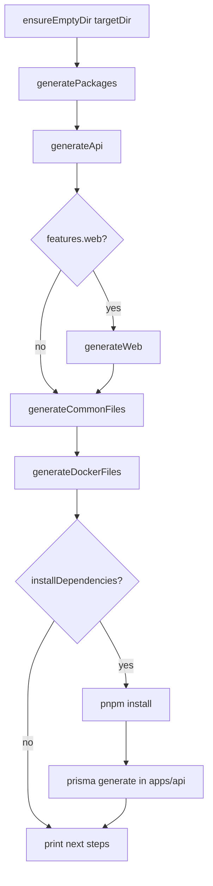

# StackForge flow — from `npx create-stackforge-app` to a running app

This document traces **what happens end to end** when someone scaffolds a project: which binaries run, which repo files execute, what gets written on disk, and what the user does next.

**Audience:** you, reviewers, and anyone debugging “where did this file come from?”

---

## 1. What the user types

Typical commands (landing site, docs, CI):

```bash
npx create-stackforge-app@latest my-saas-app -y
# or with flags:
npx create-stackforge-app@latest my-saas-app -y --database sqlite --no-docker --preset dashboard
```

| Part          | Meaning                                                                                                                                    |
| ------------- | ------------------------------------------------------------------------------------------------------------------------------------------ |
| `npx`         | Downloads (or uses cache) the npm package **`create-stackforge-app`**, then runs its **`bin`** entry.                                      |
| `@latest`     | Resolves to the newest version on [npm](https://www.npmjs.com/package/create-stackforge-app) (e.g. `1.4.2` today; `1.5.0` when published). |
| `my-saas-app` | **Project name** → folder name and npm scope seed (`@my-saas-app/...`).                                                                    |
| `-y`          | Skip interactive prompts; use defaults (see below).                                                                                        |
| Flags         | Override database, Docker, preset, install behavior (see [create command](#3-cli-entry-create-command)).                                   |

**Requirements on the machine:** Node.js, and **pnpm** (via Corepack or global install) if `--install` is on (default).

---

## 2. npm package → Node entry (first code that runs)

Published package layout (simplified):

```text
create-stackforge-app/
├── package.json          # "bin": { "create-stackforge-app": "bin/...", "stackforge": "bin/..." }
├── bin/
│   ├── create-stackforge-app.js   ← npx runs this for scaffold
│   └── stackforge.js              ← used later inside generated projects
├── dist/src/             # compiled TypeScript
└── templates/            # EJS templates copied into the tarball
```

**`bin/create-stackforge-app.js`** only loads compiled CLI code:

```javascript
require("../dist/src/index.js");
```

So every scaffold goes through **`src/index.ts`** in this repo (after `pnpm run build` at publish time).

There is a **second** binary, **`stackforge`**, wired to **`dist/src/stackforge.js`** — that is **not** used during `npx create`; it is used **inside** the generated monorepo (`pnpm run doctor`, `pnpm exec stackforge …`).

---

## 3. CLI entry: create command

| File                                                  | Role                                                                   |
| ----------------------------------------------------- | ---------------------------------------------------------------------- |
| [`src/index.ts`](../src/index.ts)                     | Creates Commander program, registers **`create`**, prints `--version`. |
| [`src/commands/create.ts`](../src/commands/create.ts) | Parses flags, calls prompts + **`generateProject`**.                   |

Default subcommand: **`create [project-name]`** (so the project name can be the first argument).

**Flags (common):**

| Flag                                       | Effect                                                            |
| ------------------------------------------ | ----------------------------------------------------------------- |
| `-c, --cwd <dir>`                          | Parent directory for the new folder (default: current directory). |
| `-d, --database postgresql \| sqlite`      | Prisma datasource + migration SQL variant.                        |
| `--docker` / `--no-docker`                 | Emit `docker-compose.yml` + Dockerfiles or skip.                  |
| `--install` / `--no-install`               | Run `pnpm install` + Prisma generate after files are written.     |
| `-y, --yes`                                | Non-interactive mode.                                             |
| `-p, --preset minimal \| api \| dashboard` | Which apps/features to generate (default: **dashboard**).         |

---

## 4. Config: prompts or `-y` defaults

| File                                                    | Role                                                                             |
| ------------------------------------------------------- | -------------------------------------------------------------------------------- |
| [`src/prompts/project.ts`](../src/prompts/project.ts)   | Interactive **inquirer** questions or **`buildNonInteractiveConfig`** when `-y`. |
| [`src/utils/validation.ts`](../src/utils/validation.ts) | Sanitize name, validate npm package name, ensure target directory is **empty**.  |

**`-y` defaults** (if flags not passed):

- Description: generic full-stack blurb
- Database: **postgresql**
- Docker: **true**
- Install dependencies: **true**
- Preset: **dashboard** (unless `-p` set)

Output: a **`ProjectConfig`** object: `projectName`, `targetDir`, `database`, `docker`, `preset`, `installDependencies`, etc. A **JWT secret** is generated later in **`generateProject`** if not provided.

**Presets** ([`src/layout.ts`](../src/layout.ts)):

| Preset        | Web app | User admin UI | Profile pages |
| ------------- | ------- | ------------- | ------------- |
| **dashboard** | yes     | yes           | yes           |
| **minimal**   | yes     | no            | no            |
| **api**       | no      | yes (API)     | yes (API)     |

---

## 5. Generation pipeline (`generateProject`)

Orchestrator: [`src/generators/project.ts`](../src/generators/project.ts)



### Step 0 — Directory guard

| File                                                             | Role                                                                                                          |
| ---------------------------------------------------------------- | ------------------------------------------------------------------------------------------------------------- |
| [`src/utils/file.ts`](../src/utils/file.ts) **`ensureEmptyDir`** | Creates `targetDir` if missing; **throws** if it already contains files (does **not** wipe existing folders). |

On **failure during steps 1–5** (generators only), **`cleanup()`** runs **`fs.remove(targetDir)`** — deletes the **entire** new project folder (see security note in reviews).

### Step 1 — Shared packages (`generatePackages`)

| File                                                          | Role                                                  |
| ------------------------------------------------------------- | ----------------------------------------------------- |
| [`src/generators/packages.ts`](../src/generators/packages.ts) | Renders **`templates/packages/**`** into `packages/`. |

Creates workspace packages, including:

- `packages/eslint-config`
- `packages/typescript-config`
- **`packages/contracts`** — Zod schemas shared by API and web

npm scope comes from project name: **`npmScope()`** in [`src/layout.ts`](../src/layout.ts) → e.g. `@my-saas-app`.

### Step 2 — API (`generateApi`)

| File                                                | Role                                                   |
| --------------------------------------------------- | ------------------------------------------------------ |
| [`src/generators/api.ts`](../src/generators/api.ts) | Renders **`templates/api/**`** into **`apps/api/`\*\*. |

Includes:

- NestJS app (modules, auth, **users**, Prisma, Swagger)
- **`apps/api/prisma/schema.prisma`** (User model; DB provider from config)
- **Initial migration** copied from template (`postgresql` vs `sqlite` SQL)
- **`apps/api/.env`** from template (DATABASE_URL, JWT_SECRET, etc.)
- Jest unit/e2e config, ESLint, Dockerfile template when Docker is enabled later

**Shipped domain model on create:** **User** + **auth** only (register/login/JWT). No extra CRUD resources until **`stackforge g resource`** (1.5.0+).

### Step 3 — Web (`generateWeb`) — if preset includes web

| File                                                | Role                                                   |
| --------------------------------------------------- | ------------------------------------------------------ |
| [`src/generators/web.ts`](../src/generators/web.ts) | Renders **`templates/web/**`** into **`apps/web/`\*\*. |

Next.js app: auth pages, dashboard (if preset), hooks that import types from **`packages/contracts`**.

Skipped for **`--preset api`**.

### Step 4 — Monorepo root + manifest (`generateCommonFiles`)

| File                                                      | Role                                                      |
| --------------------------------------------------------- | --------------------------------------------------------- |
| [`src/generators/common.ts`](../src/generators/common.ts) | Root **`package.json`**, workspace, README, CI, manifest. |

Important outputs:

| Output                                       | Purpose                                                                                                                                                                                 |
| -------------------------------------------- | --------------------------------------------------------------------------------------------------------------------------------------------------------------------------------------- |
| **`package.json`**                           | From [`templates/shared/root-package.json.ejs`](../templates/shared/root-package.json.ejs) — scripts: `dev`, `db:setup`, `doctor`, `info`, `generate`, `postinstall` → Prisma generate. |
| **`pnpm-workspace.yaml`**                    | `apps/*`, `packages/*`.                                                                                                                                                                 |
| **`stackforge.json`**                        | **Manifest v2** — preset, database, docker, `apps.api` / `apps.web`, features; used by **`stackforge doctor`** and future generators.                                                   |
| **`.github/workflows/ci.yml`**               | Generated project CI (lint, test, migrate).                                                                                                                                             |
| **`AGENTS.md`**, **`.stackforge/README.md`** | Ownership / tooling hints for humans and agents.                                                                                                                                        |

Dev dependency: **`create-stackforge-app`** at a semver range (e.g. `^1.5.0`) so **`node_modules/.bin/stackforge`** exists for `pnpm run doctor`.

### Step 5 — Docker (`generateDockerFiles`)

| File                                                      | Role                                                   |
| --------------------------------------------------------- | ------------------------------------------------------ |
| [`src/generators/docker.ts`](../src/generators/docker.ts) | Compose + multi-stage Dockerfiles when `docker: true`. |

If `--no-docker`, this step still runs but emits minimal or skipped files per template logic (compose optional).

### How templates become files

All generators use **`renderTemplate`** in [`src/utils/file.ts`](../src/utils/file.ts):

1. Read **`templates/.../*.ejs`**
2. Render with **EJS** and config data (project name, scope, JWT, flags)
3. Write to the path under **`targetDir`**

Templates live **inside the npm package**; users do not clone StackForge to scaffold.

---

## 6. Optional install phase

If **`installDependencies: true`** (default with `-y`):

1. **`corepack enable`** (best effort)
2. **`pnpm install`** at project root — installs all workspace packages + **`create-stackforge-app`** devDependency
3. **`pnpm prisma generate`** in **`apps/api`** (CLI step; also **`postinstall`** on root runs generate again)

If install **fails**, the **folder is kept** (partial project); CLI prints manual `pnpm install` hint.  
If a **generator** step failed **before** install, **`cleanup`** may have **removed** the whole folder.

---

## 7. What the user sees after success

CLI prints **next steps** from **`printSuccess()`** in [`src/generators/project.ts`](../src/generators/project.ts), roughly:

```bash
cd my-saas-app
pnpm run db:setup          # prisma generate + migrate dev (creates DB)
pnpm dev                   # contracts build + API + web (if preset has web)
pnpm run doctor            # stackforge doctor
```

Typical URLs (dashboard preset):

- Web: `http://localhost:3002`
- API: `http://localhost:3001`
- Swagger: `http://localhost:3001/docs`

---

## 8. After create: scripts in the generated app

Root **`package.json`** (template) wires maintenance to the **`stackforge`** bin from **`create-stackforge-app`**:

| Script                                | What runs                                                                                                                      |
| ------------------------------------- | ------------------------------------------------------------------------------------------------------------------------------ |
| **`pnpm run doctor`**                 | [`src/commands/doctor.ts`](../src/commands/doctor.ts) — Node/pnpm versions, env, manifest paths.                               |
| **`pnpm run info`**                   | [`src/commands/info.ts`](../src/commands/info.ts) — versions from manifest + package.json.                                     |
| **`pnpm run generate -- resource …`** | [`src/commands/generate-resource.ts`](../src/commands/generate-resource.ts) (1.5.0+) — add Prisma + Nest + contracts resource. |
| **`pnpm run db:setup`**               | Prisma generate + **`migrate dev`** in API.                                                                                    |
| **`pnpm dev`**                        | **`predev`**: build contracts + prisma generate; then concurrent dev servers.                                                  |

Entry for diagnostics: **`bin/stackforge.js`** → **`src/stackforge.ts`**.

---

## 9. Generated project shape (dashboard + sqlite, conceptual)

```text
my-saas-app/
├── stackforge.json              # manifest v2 (source of truth for stackforge CLI)
├── package.json                 # monorepo scripts + create-stackforge-app devDep
├── pnpm-workspace.yaml
├── apps/
│   ├── api/                     # NestJS + Prisma + auth + users
│   │   ├── prisma/schema.prisma
│   │   └── src/...
│   └── web/                     # Next.js (omit for api preset)
├── packages/
│   ├── contracts/               # Zod + shared types
│   ├── eslint-config/
│   └── typescript-config/
├── docker-compose.yml           # if docker enabled
└── .github/workflows/ci.yml
```

---

## 10. Landing site vs scaffold (separate path)

The **marketing site** (`landing/`, e.g. `stack-forge.aitaouss.me`) is **not** part of `npx create`. It:

- Builds install commands (`npx create-stackforge-app@…`)
- Sends GA4 events **`click_npm`** / **`click_github`** ([`landing/src/lib/analytics.ts`](../landing/src/lib/analytics.ts))

See [`landing/docs/ANALYTICS_SETUP.md`](../landing/docs/ANALYTICS_SETUP.md).

---

## 11. Quick reference — repo files touched by one scaffold

| Stage            | Primary source files                                                             |
| ---------------- | -------------------------------------------------------------------------------- |
| Bin bootstrap    | `bin/create-stackforge-app.js` → `src/index.ts`                                  |
| CLI              | `src/commands/create.ts`                                                         |
| Config           | `src/prompts/project.ts`, `src/utils/validation.ts`                              |
| Orchestration    | `src/generators/project.ts`                                                      |
| Generators       | `src/generators/packages.ts`, `api.ts`, `web.ts`, `common.ts`, `docker.ts`       |
| Templates        | `templates/{shared,packages,api,web}/**/*.ejs`                                   |
| Layout / presets | `src/layout.ts`                                                                  |
| Post-create CLI  | `src/stackforge.ts`, `src/commands/doctor.ts`, `info.ts`, `generate-resource.ts` |

---

## 12. Version and npm publish (context)

When maintainers bump **`package.json`** version and push to **`main`**, [`.github/workflows/publish.yml`](../.github/workflows/publish.yml) can publish **`create-stackforge-app@x.y.z`** to npm. The next **`npx create-stackforge-app@latest`** then ships that version’s **`templates/`** and CLI behavior.

Generated **`stackforge.json`** records **`stackforgeVersion`** at create time so **`stackforge info`** shows which CLI generation the project was born with.
